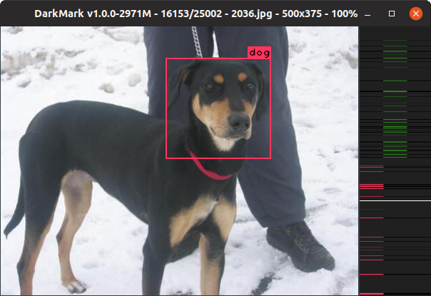
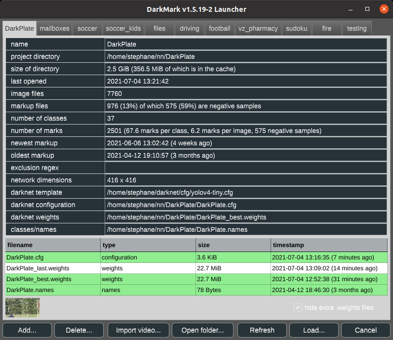
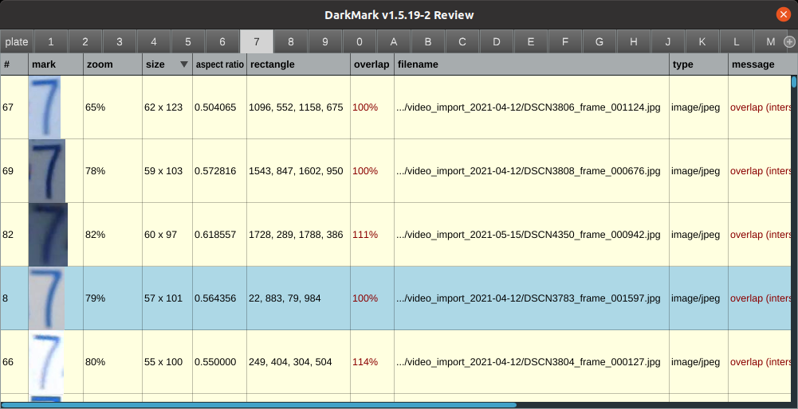
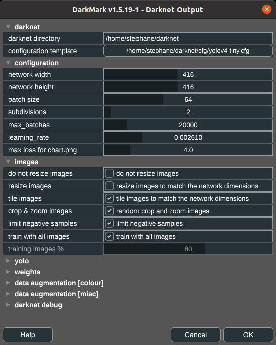

# What is DarkMark?

[](https://www.youtube.com/watch?v=w1lTCO2Kmsc)

DarkMark is a C++ GUI tool used to annotate images for use in neural networks.  It was written specifically to be used with the [Darknet](https://github.com/AlexeyAB/darknet) neural network framework, and has several features tailored for use with Darknet and YOLO.



When you first launch DarkMark, you can specify a Darknet-style neural network to load with the selected project.  DarkMark uses that neural network to assist you in marking up more images.



Several different review capabilities exist to quickly review all the annotations and highlight some common errors.



Once ready, DarkMark can also be used to generate all of the Darknet and YOLO (or other) configuration files to train a new neural network.  This includes the modifications needed to the .cfg file, as well as the .data, training and validation .txt files.  DarkMark will also create some shell scripts to start the training and copy the necessary files between computers.



# License

DarkMark is open source and published using the GNU GPL v3 license.  See license.txt for details.

# How to Build DarkMark

Extremely simple easy-to-follow tutorial on how to build [Darknet](https://github.com/hank-ai/darknet#table-of-contents), [DarkHelp](https://github.com/stephanecharette/DarkHelp#building-darkhelp-linux), and DarkMark:

[](https://www.youtube.com/watch?v=WTT1s8JjLFk)

DarkMark requires both [Darknet](https://github.com/hank-ai/darknet#linux-cmake-method) and [DarkHelp](https://github.com/stephanecharette/DarkHelp#building-darkhelp-linux) to build.

Once Darknet and DarkHelp have been built and installed, run the following commands to build DarkMark on Ubuntu:

    sudo apt-get install build-essential libopencv-dev libx11-dev libfreetype6-dev libxrandr-dev libxinerama-dev libxcursor-dev libmagic-dev libpoppler-cpp-dev
    cd ~/src
    git clone https://github.com/stephanecharette/DarkMark.git
    cd DarkMark
    mkdir build
    cd build
    cmake -DCMAKE_BUILD_TYPE=Release ..
    make -j4 package
    sudo dpkg -i darkmark*.deb

If you are using WSL2, Docker, or a Linux distro that does not come with the default fonts typically found on Ubuntu, you'll also need to install this:

    sudo apt-get install fonts-liberation

## ONNX Runtime C++ Dependency

To enable auto-annotation with ONNX models, you need the ONNX Runtime C++ library.

**Manual Setup:**

1. Download the latest ONNX Runtime C++ package for your platform from:
   https://github.com/microsoft/onnxruntime/releases

   - For Linux: download the `onnxruntime-linux-x64-<version>.tgz`
   - For GPU support (Linux with CUDA): download `onnxruntime-linux-x64-gpu-<version>.tgz`
   - For Windows: download the `onnxruntime-win-x64-<version>.zip`
   - For GPU support (Windows with CUDA): download `onnxruntime-win-x64-gpu-<version>.zip`

   DarkMark will automatically detect and use the CUDA execution provider for GPU acceleration if you install a GPU-enabled version of ONNX Runtime.

**Important:** For GPU support, you need both CUDA and cuDNN installed on your system:
- **CUDA**: Install from [NVIDIA's website](https://developer.nvidia.com/cuda-downloads)
- **cuDNN**: Download from [NVIDIA's cuDNN page](https://developer.nvidia.com/cudnn) (requires free NVIDIA account)

**Compatibility:** Refer to the [ONNX Runtime CUDA Execution Provider requirements](https://onnxruntime.ai/docs/execution-providers/CUDA-ExecutionProvider.html#requirements) for detailed compatibility information between ONNX Runtime versions, CUDA versions, and cuDNN versions.

2. Extract the archive to `/usr/local/onnxruntime` (or `/usr/onnxruntime`), so you have:
   ```
   /usr/local/onnxruntime/lib/
   /usr/local/onnxruntime/include/
   ```
   For example:
   ```sh
   sudo tar -xzf onnxruntime-linux-x64-<version>.tgz -C /usr/local
   sudo mv /usr/local/onnxruntime-linux-x64-<version> /usr/local/onnxruntime
   sudo ldconfig
   ```

4. CMake will automatically detect and use the system-installed ONNX Runtime.

**Note:**
- CMake will not auto-download ONNX Runtime. You must perform the above steps before configuring the project.
- If the ONNX Runtime library is not found, CMake will stop with an error.
- If you encounter CUDA-related errors like "libcudnn.so.9: cannot open shared object file", ensure both CUDA and cuDNN are properly installed and the libraries are in your system's library path.

**Quick install example for ONNX Runtime 1.22.0 on Linux:**
```sh
wget https://github.com/microsoft/onnxruntime/releases/download/v1.22.0/onnxruntime-linux-x64-1.22.0.tgz
sudo tar -xzf onnxruntime-linux-x64-1.22.0.tgz -C /usr/local
sudo mv /usr/local/onnxruntime-linux-x64-1.22.0 /usr/local/onnxruntime
sudo ldconfig
```

**Note:**
If you install ONNX Runtime to `/usr/local/onnxruntime`, you must add its `lib` directory to the system library path so the dynamic linker can find `libonnxruntime.so.1` at runtime. To do this, run:

```sh
echo "/usr/local/onnxruntime/lib" | sudo tee /etc/ld.so.conf.d/onnxruntime.conf
sudo ldconfig
```

This only needs to be done once after installing or updating ONNX Runtime.

# Doxygen Output

The official DarkMark documentation and web site is at <https://www.ccoderun.ca/darkmark/>.

Some links to specific useful pages:

- [DarkMark keyboard shortcuts](https://www.ccoderun.ca/darkmark/Keyboard.html)
- ["How To" on image markup](https://www.ccoderun.ca/darkmark/ImageMarkup.html)
- [Data augmentation in Darknet](https://www.ccoderun.ca/darkmark/DataAugmentation.html)
- [Darknet configuration files](https://www.ccoderun.ca/darkmark/Configuration.html)
- [Darknet FAQ](https://www.ccoderun.ca/programming/darknet_faq/)
- [Discord server for Darknet, YOLO, DarkHelp, and DarkMark](https://discord.gg/zSq8rtW)
